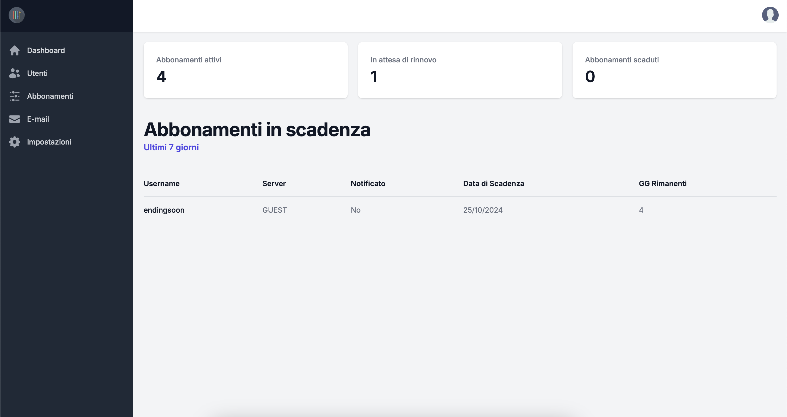
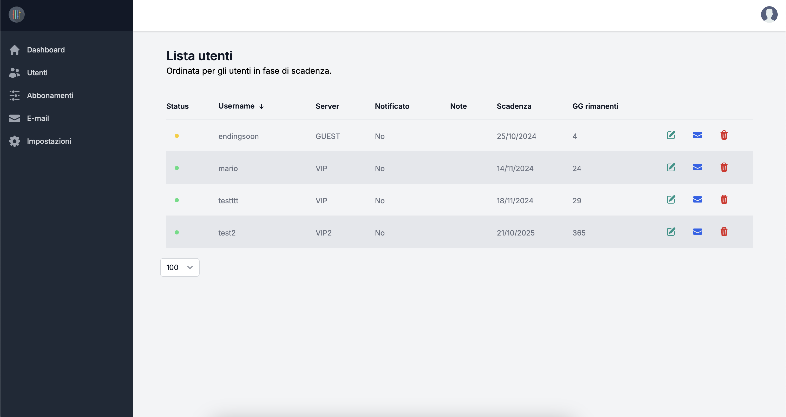

# 📊 Subscription Dashboard

A powerful **Next.js** and **TypeScript** based dashboard to manage user subscriptions for your personal services. Built with scalability and performance in mind, this dashboard leverages the best modern libraries, including **tRPC**, **Zod**, **React-Hook-Form**, **TailwindCSS**, **Winston**, **Nodemailer**, and **Prisma**.

The dashboard offers a smooth and intuitive interface for managing users and subscriptions, allowing you to effortlessly add, update, and track user subscriptions while maintaining full control over notifications and logs.

## 🌐 Live Demo

You can try a live demo of the dashboard at:

[subscription-manager.notfiliberto.xyz](https://subscription-manager.notfiliberto.xyz)

-   Username: `admin`
-   Password: `admin`




# 📝 Key Functionalities

-   **Add Users/Subscriptions**: Use the "Create Subscription" form to add a new user and their subscription duration.
-   **Manage Subscriptions**: View and edit existing users through the user table, where you can:
    -   Modify user details
    -   Extend subscription periods
    -   Send email reminders for upcoming expiration dates
    -   Delete users from the list
-   **Send Bulk Emails**: Navigate to the "Send Emails" section to send custom messages to multiple users at once.

## 📧 Email Notifications

Ensure you have configured your Outlook email correctly via the environment variables to enable email functionality. This allows you to:

-   Notify users when their subscription is extended.
-   Send personalized reminders for expiring subscriptions.
-   Send bulk email messages to selected users.

## 📜 Logging Actions

All actions taken on users, such as:

-   Adding new users
-   Modifying user details
-   Extending subscriptions
-   Deleting users

...are logged in a file for future reference. These logs will later be accessible through a dedicated page within the dashboard, allowing you to review all historical changes and interactions.

## 🚀 Getting Started

Follow the steps below to get the dashboard running locally on your machine.

### Prerequisites

-   [Node.js](https://nodejs.org/en/) v14+ (make sure you have it installed)
-   [PostgreSQL](https://www.postgresql.org/) or any other compatible database for **Prisma**

### 1. Clone the Repository

```bash
git clone https://github.com/your-username/subscription-dashboard.git
cd subscription-dashboard
```

### 2. Install Dependencies

```bash
npm install
```

### 3. Set Environment Variables

Create a `.env` file in the main directory of the project and set these environment variables:

```bash
# Authentication
DASHBOARD_USER=admin
DASHBOARD_PASSWORD=admin

# Email configuration (for sending notifications)
NEXT_PUBLIC_EMAIL_ADDRESS=your-outlook-email@example.com
EMAIL_PASSWORD=your-email-password

# Prisma (database connection)
DATABASE_URL=file:./subscription-dashboard-manager.db?connection_limit=1
```

### 4. Set Up the Database

```bash
npx prisma db push
```

### 5. Start the Development Server

```bash
npm run dev
```

The dashboard will be available at http://localhost:3000.

## ⚙️ Usage

### 🔑 Login

For simplicity, the dashboard comes with a default admin user:

-   Username: `admin`
-   Password: `admin`

You can modify this by changing the `DASHBOARD_USER` and `DASHBOARD_PASSWORD` environment variables.

## 🛠️ Technologies Used

-   Next.js: Framework for building server-side rendered React applications.
-   TypeScript: Ensures type safety and developer experience.
-   tRPC: A fully typesafe API client/server for Next.js.
-   Zod: Schema validation to keep your data structures safe.
-   React-Hook-Form: For smooth and scalable form management.
-   TailwindCSS: For rapid UI development with utility-first CSS.
-   Winston: A logging library for structured and detailed logs.
-   Nodemailer: Simple yet powerful email service for sending notifications.
-   Prisma: ORM for connecting to your database seamlessly.

## 🌐 Deployment

To deploy this application on a server or cloud provider, ensure you have set all required environment variables in your hosting environment (e.g., Vercel, Heroku, or DigitalOcean).

Follow the steps from **Getting Started** and replace npm run dev with npm run build followed by npm start for production mode.

## 📝 Future Plans

-   **Action Logs Page**: A dedicated section for viewing all logged user actions, directly from the dashboard.
-   **User Roles**: Adding role-based access for more granular control over actions in the dashboard.
-   **Advanced Email Templates**: Customizable and more sophisticated email designs for user notifications.

## 🧑‍💻 Contributing

Feel free to fork the repository and create a pull request for any feature enhancements or bug fixes. Contributions are welcome!

## 🛡️ License

This project is licensed under the MIT License. See the LICENSE file for more information.
